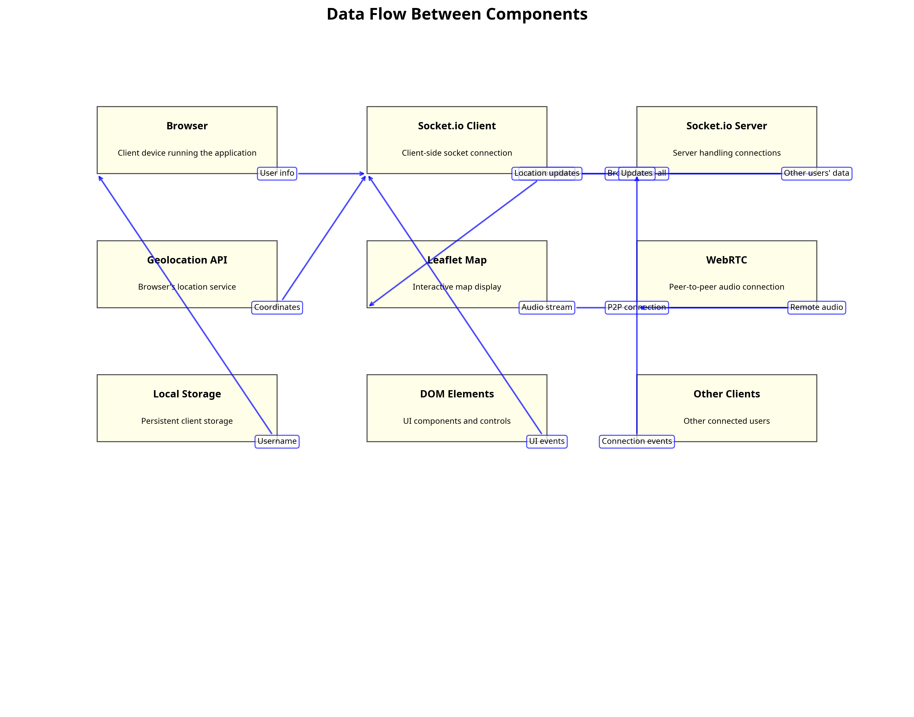
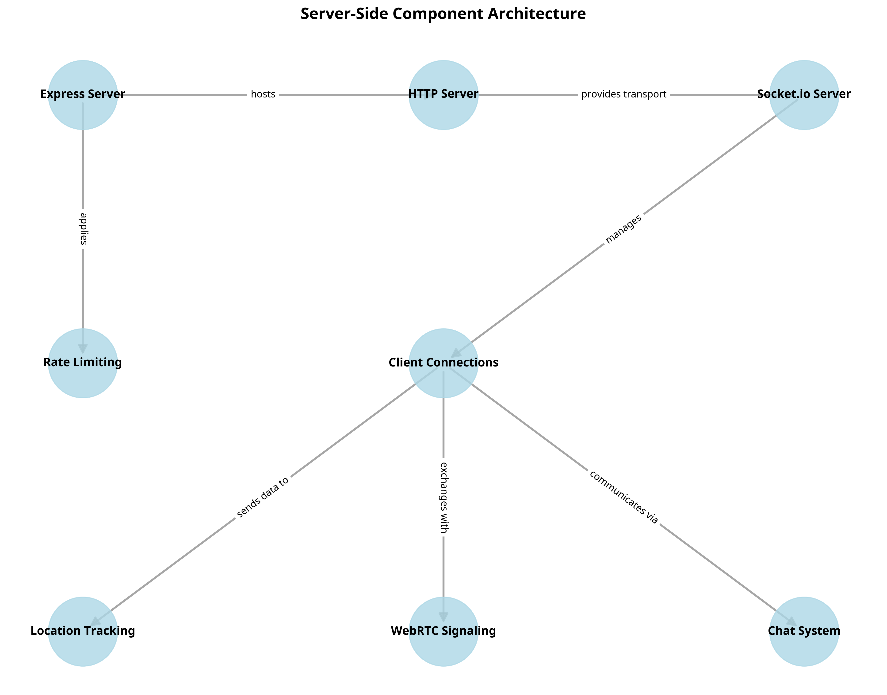
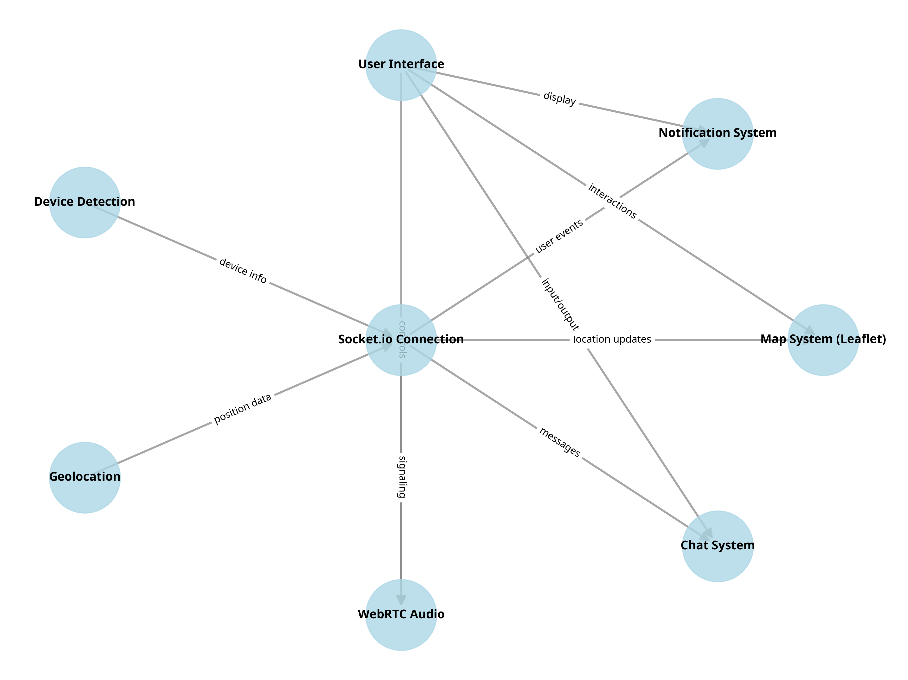
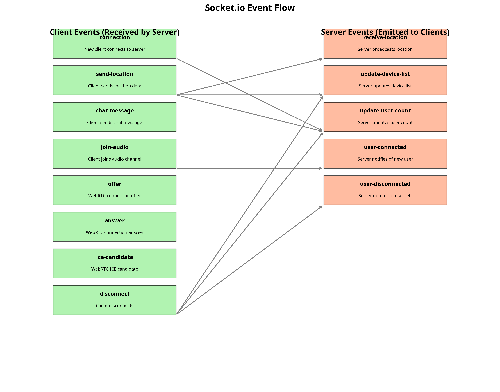

# Real-Time Location Tracker Documentation


The **Real-Time Location Tracker** is a web application designed to monitor and track the real-time locations of connected devices. It leverages interactive map visualizations (Leaflet), instant communication (WebSockets), and real-time audio communication (WebRTC). The application is suitable for various use cases, including:

  

- Fleet management

- Delivery tracking

- Team coordination

- Personal location sharing

- Emergency response

  

The application provides a responsive design for a consistent user experience across desktops, tablets, and smartphones. It also supports offline map functionality.

---

## Features
- **Real-Time Tracking:** Track device locations with continuous real-time updates.
- **Smart Device Identification:** Recognizes and categorizes devices based on user agent strings.
- **Device Connection Panel:** View a list of connected devices and their active status.
- **Customizable Icons:** Unique icons for different device types.
- **Offline Map Support:** Intelligent switching between online and offline map modes.
- **Responsive Design:** Optimized for all devices.
- **Interactive Popups:** View details of connected devices.
- **Personalized User Authentication:** Assign custom names or use default device names.
- **Activity Logs:** A comprehensive log system that tracks server notifications, connection events, and disconnections.
- **Audio Communication (WebRTC):** Real-time voice communication between connected devices.
- **Live Chat Messaging:** Send instant text messages using WebSockets.


## **Version Release**

### **Initial Release**

-   **Real-Time Location Tracker** is a web application designed for seamless, real-time device tracking.
-   **Lightweight & Optimized** for minimal server load, ensuring efficient performance.

----------

### **Version 2.0** – **Major Enhancements & New Features**

-   **Real-Time Tracking:** Continuously updates device locations on the map as they move.
-   **Smart Device Identification:** Automatically detects and categorizes devices based on their user agent (Android, iOS, Windows, Mac, etc.).
-   **Device Connection Panel:** Displays a dynamic list of all connected devices with real-time count and allows instant location viewing.
-   **Customizable Icons:** Unique icons for different device types for better visualization.
-   **Offline Map Support:** Automatically switches between online and offline map modes based on internet availability.
-   **Fully Responsive Design:** Optimized layouts for desktops, tablets, and mobile screens.
-   **Interactive Popups:** Click on a device marker to view detailed information, including device name and user identification.
-   **Personalized User Authentication:** Users can assign custom device names or use default names for identification.
-   **Audio Communication:** Real-time voice communication between connected devices using WebRTC.

 >     Recommended Version: 2.4.2

----------

### **Version 3.0 (Latest Update)** – **Advanced Features & Performance Upgrades**

-   **Enhanced Interactive Popups:** Now includes real-time device details such as battery status, connection type, and more.
-   **Activity Logs:** A comprehensive log system that tracks server notifications, connection events, and disconnections. Battery and Connection Status.
-   **Live Chat Messaging:** Instant text communication between connected devices via WebSockets.

This latest version introduces **enhanced real-time tracking, better device insights, and improved communication tools**, making the app more versatile and powerful.

 >     Recommended Version: 3.5.7

## Folder Structure
```
realtime-location-tracker/
├── public/
│   ├── assets/
│   ├── css/
│   ├── js/
│── views/
│   └── index.ejs
├── app.js
├── package.json
└── README.md
```
### Folder Details:
- **public/assets/**: Stores static assets (images, icons).
-  **public/css/**: Contains CSS stylesheets, organized by functionality:

-  `style.css`: Main application styles.

-  `panel.css`: Styles for the sidebar panel.

-  `device.css`: Styles for device-related elements.

-  `chat.css`: Styles for the chat interface.

-  `audio.css`: Styles for audio control elements.

-  `notification.css`: Styles for notifications.

-  `popup.css`: Styles for popups.

-  `responsive.css`: Styles for responsive design.

-  `icon.css`: Styles for custom icons.
- **public/js/**: Holds JavaScript files for frontend logic.
- **views/index.ejs**: Main view template.
- **app.js**: Initializes the server and routes.
- **package.json**: Contains project metadata and dependencies.
- **README.md**: Project documentation.

---

## Installation
1. **Clone the Repository:**
   ```bash
   git clone https://github.com/mahmud-r-farhan/realtime-location-tracker.git
   ```
   ```bash
   cd realtime-location-tracker
   ```
2. **Install Dependencies:**
   ```bash
   npm install
   ```
3. **Configure Offline Support(optional):**
   - Download Leaflet library and place CSS/JS files in `public/leaflet/`.
   - Generate offline map tiles and place them in `public/tiles/offline-map-tiles/`.
4. **Set Up WebRTC for Audio Communication(optional):**
   ```javascript
   const createPeerConnection = (peerId) => {
       const configuration = {
           iceServers: [
               { urls: 'stun:stun.l.google.com:19302' },
               { urls: 'turn:numb.viagenie.ca', username: 'webrtc@live.com', credential: 'muazkh' }
           ]
       };
       return new RTCPeerConnection(configuration);
   };
   ```
5. **Run the Application:**
   ```bash
   npm start
   ```

---

## Usage

  
1. Open `http://localhost:3007` in a web browser.

2. Grant location access when prompted.

3. View the real-time locations of connected devices on the map.

4. Click on device markers to view detailed information in the popup.

5. Use the microphone and speaker buttons to initiate and manage audio communication.

6. Use the chat panel (accessed via the chat icon) to send text messages.

---

## Data Flow and Architectures diagram

##### Data Flow Beetween Components:


  

##### Server-Side Component Architectur:




##### Client-Side Component Architectur:


##### Server Event Architectur (Socket.io):

  

## Explanation of the Architecture:
1.  **Geolocation:**

- The user's device provides location data (latitude, longitude, accuracy) to the application.

- This data is obtained using the browser's Geolocation API.

2.  **Device Detection:**

- The application detects the type of device (e.g., Android, iOS) using the user agent string.

- Device information is sent to the server.

3.  **User Interface:**

- The user interface displays the map, device list, chat, and notifications.

- It receives input from the user (e.g., map interactions, chat messages).

4.  **Socket.IO Connection:**

- A persistent, bidirectional connection between the client and server.

- Used for real-time data transfer:

- Location updates are sent from devices to the server and then broadcast to other connected devices.

- Chat messages are sent between users.

- Device connection/disconnection events.

5.  **Map System (Leaflet):**

- Leaflet is used to display the map and device markers.

- The map updates in real-time as device locations change.

6.  **Chat System:**

- Users can send text messages to each other through the chat interface.

- Messages are transmitted via Socket.IO.

7.  **WebRTC Audio:**

- WebRTC enables real-time audio communication between users.

- Signaling (session setup) is handled via Socket.IO.

- Audio data is transmitted directly between peers.

8.  **Notification System:**

- Displays real-time notifications about device connections, disconnections, and other events.


---

## Live Test
- Live: [Render Deployment](https://realtime-location-tracker-v9ow.onrender.com/)
- Invite multiple users to test tracking and communication features.

---

## Contributing
1. Fork the repository.
2. Create a new branch:
   ```bash
   git checkout -b user-update
   ```
3. Make changes and commit:
   ```bash
   git commit -m "Add new feature"
   ```
4. Push to branch:
   ```bash
   git push origin user-update
   ```
5. Open a pull request.

---

## License
This project is licensed under the Personal Use License. See the LICENSE file for details.

---

## Contact
- **Email:** [GMAIL](mailto:farhanstack.dev@gmail.com)
- **GitHub:** [GitHub](https://github.com/mahmud-r-farhan)


---

## FAQ
**Q: How accurate is the GPS?**  
A: Depends on device hardware (typically ±5-50 meters).  

**Q: Can I use custom map providers?**  
A: Yes! Replace `leaflet.js` with Mapbox/Google Maps.  
 

---
